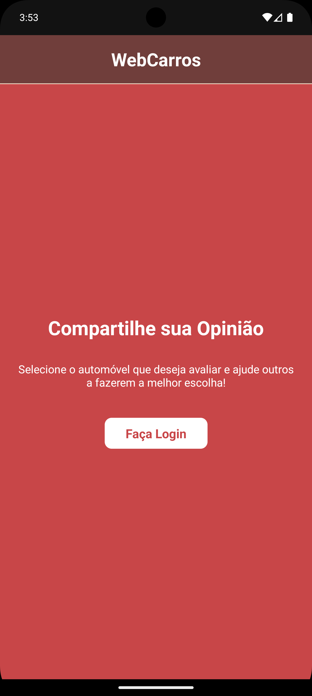
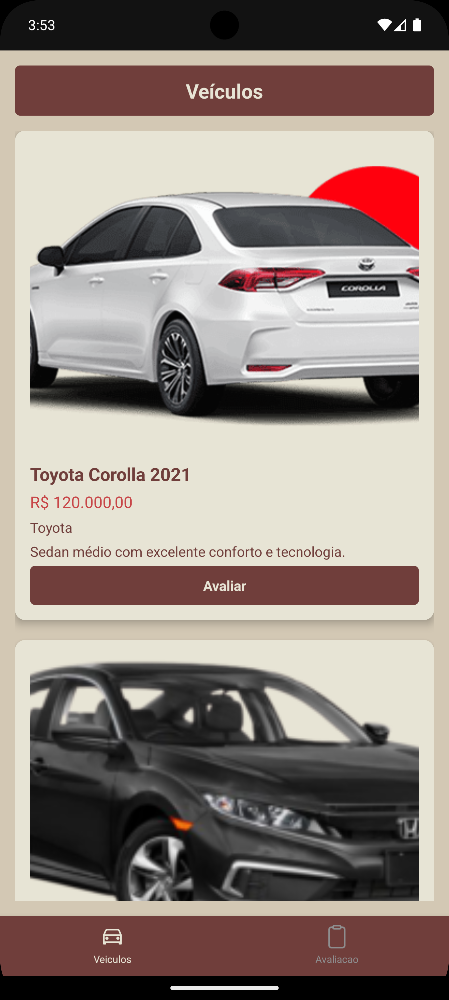
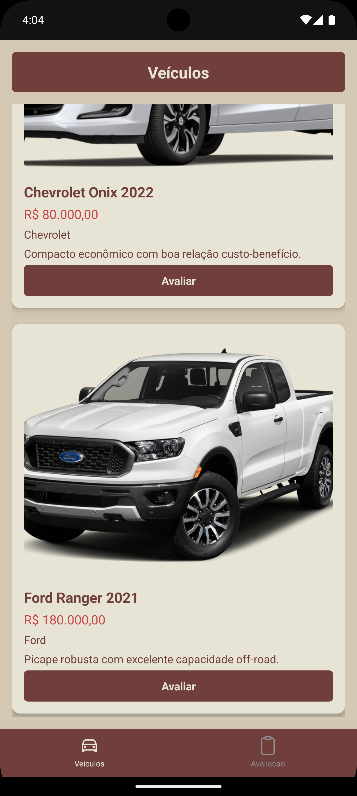
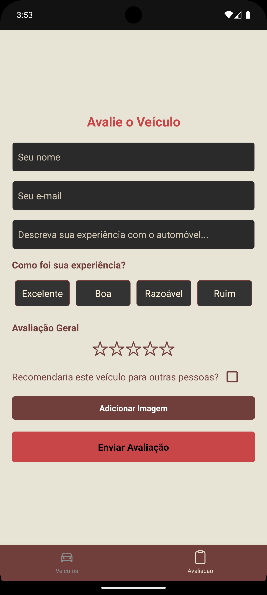

# Projeto WebCarros | App em ReactNative

# 🚗 WebCarros

Um aplicativo React Native que permite aos usuários compartilhar opiniões sobre automóveis e navegar por produtos de forma simples e intuitiva.

---

## 📝 Sobre o Projeto

O WebCarros é um aplicativo desenvolvido em React Native que permite aos usuários fazer login, visualizar produtos relacionados a automóveis, e compartilhar suas avaliações. O objetivo é facilitar a troca de informações e opiniões sobre diferentes veículos.

---

## ⚙️ Funcionalidades

- Tela de login com autenticação.
- Navegação entre telas utilizando Stack Navigator.
- Sistema de guias para navegar entre diferentes seções.
- Compartilhamento de opiniões sobre automóveis.

---

## 🛠️ Tecnologias Utilizadas

- **React Native**: Para o desenvolvimento do aplicativo.
- **React Navigation**: Para gerenciamento de navegação.
- **Context API**: Para gerenciamento de estado de autenticação.

📸 Imagens do Projeto

## Como Usar

- Clonar repositorio
- npm install
- json-server --watch database.json --port 3000
